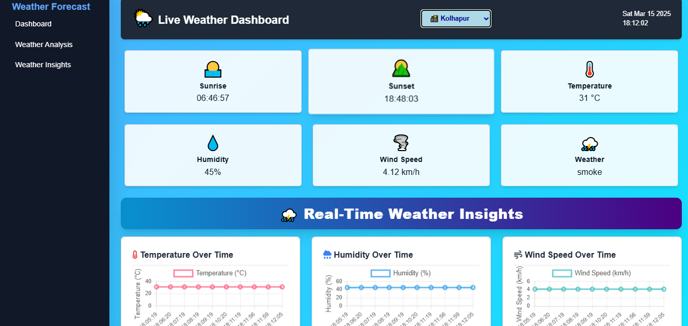
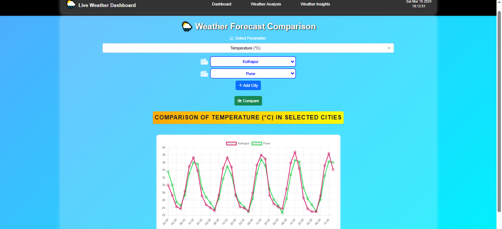
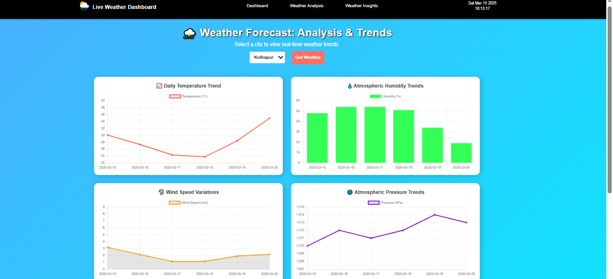

# 🌍 **Live Weather Forecasting – Your Ultimate Climate Guide**  

  
    

  

🔎 **Accurate, real-time weather insights and forecasts to help you stay ahead of changing weather conditions.**  

---

## 🌦 **Why Weather Insights Matter?**  

Weather impacts **daily life, travel plans, agriculture, and even industries.** Our platform ensures you get:  

✅ **Live weather conditions** with temperature, humidity, wind speed & more  
✅ **Future forecasts** to help you plan ahead  
✅ **Region-wise analysis** for location-based comparisons  
✅ **Interactive data visuals** for a seamless user experience  

From avoiding unexpected storms to planning your perfect vacation, **Live Weather Forecasting** is your ultimate climate companion.  

---

## 🚀 **Live Demo & Backend Repository**  

🔗 **Live App:** [Live Weather Forecasting](https://live-weather-forecasting.web.app/)  
🔗 **Backend Server:** [Weather Forecasting Server](https://github.com/VinayakR12/WeatherForecasting)  

---

## 🌟 **Key Features**  

### 🌍 **1. Real-Time Weather Insights**  
- Instantly fetch **accurate weather conditions** for any location  
- Displays temperature, humidity, wind speed, and atmospheric pressure  

### 🔮 **2. Advanced Weather Forecasting**  
- Get **hourly, daily, and weekly forecasts** for better planning  
- Analyzes **climate trends** to predict upcoming conditions  

### 🌎 **3. Region-Wise Comparison**  
- Compare multiple locations **side by side**  
- Track temperature variations, **extreme weather analysis, and seasonal patterns**  

### 📊 **4. Interactive Data Visualization**  
- **Dynamic charts & graphs** powered by **Chart.js**  
- **Smooth UI updates** for a clear, informative experience  

### 💻 **5. Modern, Responsive UI**  
- **Tailwind CSS-powered** sleek design  
- **Lightweight & optimized** for all devices  

### 🔐 **6. Secure & Scalable Backend**  
- **Python-based backend** for robust processing  
- **Deployed on Firebase** for high performance  

---

## 🛠 **Tech Stack Used**  

  
  
  
  
  
  
  

---

## 📸 **User Interface & Screenshots**  

📍 **Live Weather Dashboard** – Displays real-time weather conditions  

  
    

  

📍 **Forecast & Region-Wise Comparison** – Analyze trends across locations  

  
    

  

📍 **Dynamic Charts & Visuals** – Track climate patterns with ease  

  
    

  

---

## 🤝 Contributing  
We welcome contributions! Feel free to fork this repo, create a branch, and submit a Pull Request with your improvements. Ensure to follow the coding standards and provide meaningful commit messages.

---

